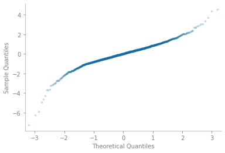
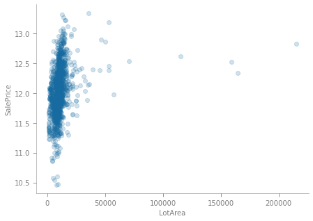
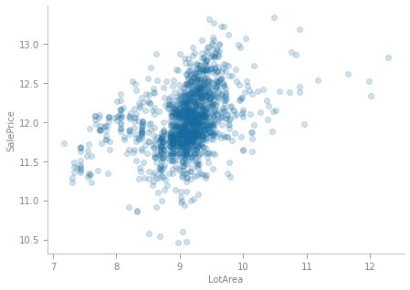

# Multiple Linear Regression Project: Ames House Prices
*The repository is a part of the final project in course MSDS 601.* 

#### by [Siwei Ma](https://www.linkedin.com/in/siwei-ma-28345856/)

# Executive Summary

Given [Ames Housing dataset](http://jse.amstat.org/v19n3/decock.pdf), the project started with an exploratory data analysis (EDA) to identify the missing values, suspicious data, and redundant variables. Then I performed a mixed stepwise selection to reduce the set of variables and select the best model based on AIC, BIC, and adjust R-squared. With the best model selected, the model assumptions were checked regarding normality, homoscedasticity, collinearity, and linearity between response and predictors. Several solutions were proposed to solve the assumption violation. The model was then tested on unseen data and scored on Root-Mean-Squared-Error (RMSE).

# Data Summary
**Data source**

The data of this project came from [Kaggle](https://www.kaggle.com/c/house-prices-advanced-regression-techniques). 

**Data Dictionary**

As we categorize similar variables, we can see that some variables have very similar information, such as MS90 in MSSubClass and Duplx in BldgType are exactly identical. The data structure issue will be detailed discussed in the initial processing section.

|Category|Index|Name|
|--|--|--|
|**Location**|2|MSZoning|
||12|Neighborhood|
||13|Condition1|
||14|Condition2|
|**Lot**|3|LotFrontage|
||4|LotArea|
||7|LotShape|
||10|LotConfig|
|**Roof**|21|RoofStyle|
||22|RoofMatl|
|**Exterior**|23|Exterior1st|
||24|Exterior2nd|
||25|MasVnrType|
||26|MasVnrArea|
||27|ExterQual|
||28|ExterCond|
|**Foundation**|29|Foundation|
|**Basement**|30|BsmtQual|
||31|BsmtCond|
||32|BsmtExposure|
||33|BsmtFinType1|
||34|BsmtFinSF1|
||35|BsmtFinType2|
||36|BsmtFinSF2|
||37|BsmtUnfSF|
||38|TotalBsmtSF|
||47|BsmtFullBath|
||48|BsmtHalfBath|
|**Bath**|47|BsmtFullBath|
||48|BsmtHalfBath|
||49|FullBath|
||50|HalfBath|
|**Bedroom**|51|BedroomAbvGr|
|**Kitchen**|52|KitchenAbvGr|
||53|KitchenQual|
|**Fireplace**|56|Fireplaces|
||57|FireplaceQu|
|**Garage**|58|GarageType|
||59|GarageYrBlt|
||60|GarageFinish|
||61|GarageCars|
||62|GarageArea|
||63|GarageQual|
||64|GarageCond|
|**Porch**|66|WoodDeckSF|
||67|OpenPorchSF|
||68|EnclosedPorch|
||69|3SsnPorch|
||70|ScreenPorch|
|**Pool**|71|PoolArea|
||72|PoolQC|
|**Pavement**|5|Street|
||6|Alley|
||65|PavedDrive|
|**Year**|19|YearBuilt|
||20|YearRemodAdd|
||76|MoSold|
||77|YrSold|
|**Indoor**|9|Utilities|
||39|Heating|
||40|HeatingQC|
||41|CentralAir|
||42|Electrical|
|**Outdoor**|8|LandContour|
||11|LandSlope|
|**Type**|1|MSSubClass|
||15|BldgType|
||16|HouseStyle|
|**OverallEstimation**|17|OverallQual|
||18|OverallCond|

# Process
## Data analysis
To prepare the data for modeling, we list the variables with missing values as shown below. Without dropping any observations, we fill the null data with ‘None’ or 0 in cases where the absence of data indicates the lack of a feature, for example, in variable `Alley`, we assume that the missing value means that the house has no alley. In other cases, I assigned the values to missing cells based on the context. For example, the data indicates that a house indeed has a kitchen but `KitchenQual` information is missing. Thus, I filled the null with Typical/Average(TA). See the notebook for more details.

> Figure 1. Predictors with missing value by percentage.

Also, as mentioned by [Ames Housing dataset](http://jse.amstat.org/v19n3/decock.pdf), it is safe to remove any observation with `GrLivArea` higher than 4000, as shown in Fig 2. Furthermore, As mentioned in the [post](https://www.kaggle.com/juliencs/a-study-on-regression-applied-to-the-ames-dataset), we proceed to recode the ‘MSSubClass’ and ‘MoSold’ predictors to string categorical values, from the previous numeric encoding. 

> Figure 2. Suspicious data.

Then we changed all categorical predictors into dummies. Note that `pd.get_dummies(data, drop_first=True)` sets the reference level based on the alphabet which is not applicable for this project. If the proportion of cases in the reference level is small, we expect to have a severe multicollinearity issue. In order to mitigate the multicollinearity, we set the dummy with the largest proportion of cases as the reference level.

Since multicollinearity between any of the predictors in the model will result in less reliable t-tests for the significance of a predictor, we decided to calculate the variance inflation factors (VIF’s) for the candidate predictor variables. The full initial model consists of 219 predictors with all of the attendant dummy variables. We iteratively check VIF scores for all parameters in the model, identify a few with the most extreme VIF’s, and remove them from the pool of candidates. For example, we found that `None` in `GarageFinish` are exactly the same as `None` in `GarageType`. After removing, the amount of parameters with a VIF beyond the threshold in the full model decreases to 29, with a majority of them being attendant dummy variables. But we won't drop more. Although Multicollinearity could result in higher p-values and it becomes difficult for us to examine the relationship between each predictor and response, we will see that we can still identify the significant terms in model selection.

In addition, I also perform log-transformation on response to make sure that predicting expensive houses and cheap houses will affect the result equally.

## Model selection
After dropping some redundant variables, we still have 219 variables. It is natural to wonder which variables are the most important ones. The mixed stepwise selection was conducted to determine which variables are associated with the response.

> Figure 3. AIC, BIC, and adjusted R-squared are shown for the best models of each model number.

As BIC penalizes model complexity more heavily compared with AIC and prevents false-positive findings more effectively, we chose BIC as model selection criteria to select the best model.

## Model diagnostics
### Normality

> Figure 4. Histogram plot of residual of the "best" model.

As shown in Fig 4, the histogram of the model’s residual values is fairly symmetric but has heavy tails and a more leptokurtic shape than a normal distribution. This is also visible on the QQ plot as the values towards the extremes of the plot deviate further from a straight line than the points in the middle as shown in Fig 5.

> Figure 5. QQ plot of the "best" model.

### Homoscedasticity

In order to confirm that it makes sense to construct a linear model from this data, we visualize the initial full model’s fitted and residual values (Fig 6) to detect any presence of heteroscedasticity, which would violate another fundamental assumption of the classical linear regression model. Although we rejected the null and concluded that there exists heteroscedasticity in the model by the Breusch-Pagan test. We can see residuals scattered around zero in Fig 6. Also considering that the sample size is large (p/n>30), the skewness of data is not expected to impact the model estimation or inference very much.

> Figure 6. Fitted values vs. residuals plot of the "best" model.

### Linearity

After scrutinizing the plot between Y and X, I found that LotArea suffers from severe non-linearity. Thus, we apply a simple log-transformation on the ‘LotArea’ variable to address the observed nonlinearity with this predictor variable. 

  
   

> Figure 7. Scatter plot of SalePrice over LotArea. Before the log transformation (left), After the log transformation (right).

### High influential points

Based on the externally studentized residual value, H leverage, and cook’s distance represented by the area of a point, we identify points at indices 1000, and 410 to be outliers with high influence. Therefore, the results of the Breusch-Pagan test are likely impacted by the presence of these high influence points. The models with and without the influential points were included in the notebook.

> Figure 8. influence plot of the "best" model.

# Conclusion

Based on our model trained on the Ames, Iowa housing prices data, we find that numeric features such as `OverallQual`, `OverallCond`, `GrLivArea`, `GarageCars` etc. have a positive influence on the sales price. The categorical features such as `NridgHt` in `Neighborhood`, `BrkFace` in `Exterior1st` etc. have a positive influence on the sales price. In contrast, the categorical features such as no `CentralAir`, commercial zoning classification (C) in `MSZoning` etc. have a negative influence on the sales price. See the notebook for more details.

The predicted R-squared is 0.928 and the regular R-squared is 0.934. Since there is only a minor discrepancy between predicted R-squared and regular R-squared, it seems that we did not have a severe overfitting issue in the model.

# Prediction

The final model was then tested on unseen data and submitted to Kaggle to be evaluated by RMSE. The RMSE is 0.13637.
